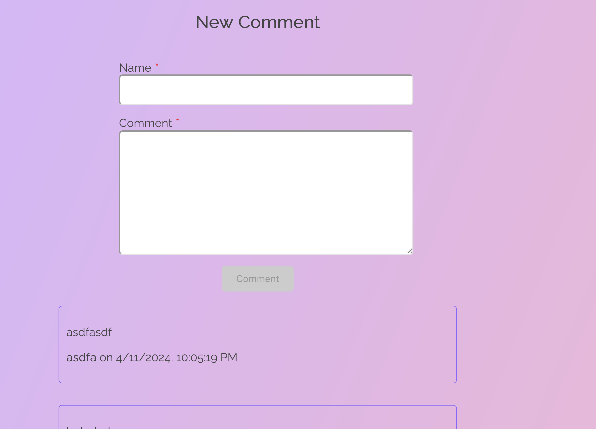

# Getting Started

Welcome! To get started, run:

```
cd client/
npm i
npm start
cd ..
npm i
npm run dev
```

## UI

Getting comments/homepage:


Posting a new comment:


## Testing

To run tests, run `npm test`. This will run tests for the API.

I wanted to test rendering the React components. However, I ran into some configuration errors in `/client`. The first error that I tried resolving was a `SyntaxError: Cannot use import statement outside a module`. I tried following these steps in the [Jest Getting Started documentation](https://jestjs.io/docs/getting-started), as well as in [this Stack Overflow answer](https://stackoverflow.com/questions/58613492/how-to-resolve-cannot-use-import-statement-outside-a-module-from-jest-when-run), but that did not resolve the error. I spent quite some time trying to get this resolved, but due to time constraints, I decided to write tests for the API.

## Assumptions

- In the wireframe, the two example comments show "Thursday at 4pm" and "April 1st at 2pm". I was unclear whether these dates and times were rounded or exact. For the purpose of this exercise, I chose to display the exact date and time. However, with more conversation, I could have implemented a different date and time rendering.

## Questions

- Since the GET endpoint was provided for a single comment, I'm wondering what the use of this could be.

## Future Functionality/Refactoring

- Handle showing errors on GET request for /getComments
- Storing HEX values in variables and re-using them instead of repeating them
- Validate name field (i.e. do not allow duplicate names). This might work best with a login feature.
- If a user is logged in and they see their own comment(s), they could delete the comment(s). Then, a confirmation could appear to confirm or cancel the action. Finally, a toast notification could appear to notify whether the comment was deleted and the action was successful.
